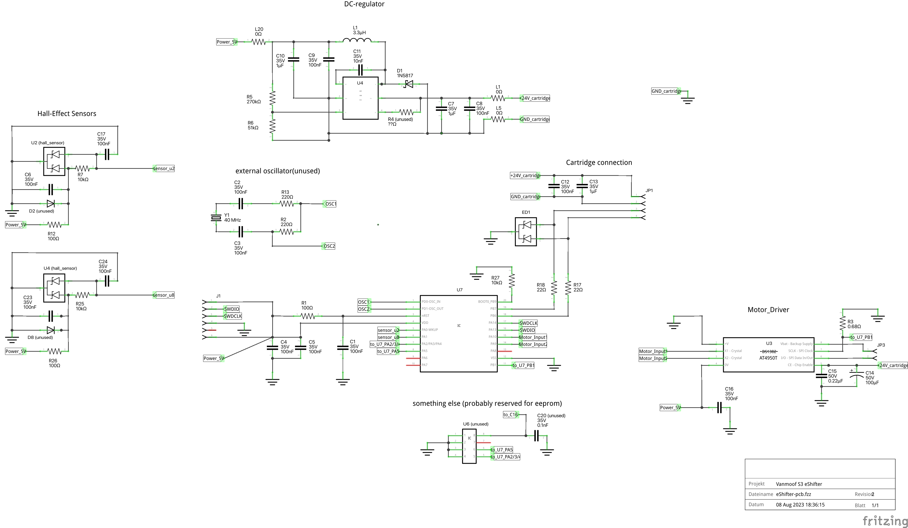

# Error 44 / Communication issues

So heres how to diagnose and fix it - most of the time.

**A few important things beforehand:**

\- I'll be describing the debugging without an external Lab-Powersupply using only the bikes power. Please be careful not to short anything on the 24V line or the RX line you'll probably kill your bike if you do. (Almost happened to me, sending 24V though the tx lines is no bueno).

\- If you have access to a lab power supply USE IT, it makes things much easier and you are much less likely to fry your bike.

\- I take no responsibility if you fry your bike trying to fix the shifter. You need to know your way around electronics.

**Tools you'll need:**

\- tools for disassembling the shifter and bike (Vanmoof Toolbox, various allen keys)

\- digital multimeter

\- soldering iron

\- tweezers (for potential desoldering of smd parts)

\- wire

\- replacement parts (mostly assortment of SMD resistors)

\

**Getting to the board**

1. Err44 indicates a communication issue with your shifter. To diagnose this you'll need to disassemble your eShifter to gain access to the eShifters circuit board. So remove the shifter from your bike (See Vanmoof Howtos here: [https://www.youtube.com/watch?v=qehoD-6xbkI](https://www.youtube.com/watch?v=qehoD-6xbkI) and here [https://www.youtube.com/watch?v=FyDecZQhlAw](https://www.youtube.com/watch?v=FyDecZQhlAw\&pp=ygUvdmFubW9vZiBzMyAgaG93IHRvIHJlcGxhY2Ugc2hpZnRlciByZXBsYWNlbWVudCA%3D))
2. Next open it up by removing the 4 screw holding the eShifter together. You can split the housing open by using a flat-screwdriver or a knife and slowly wiggling it in from the bottom (there is a slighty rougher area on the bottom where this can be done quite easily)
3. The pcb is located in the front-half of the eShifter housing. It's secured on 3 small plastic protrusions, you should be able to take the pcb out by scraping away a bit of these protrusions and then lever the pcb out carefully with a flathead screwdriver.

**Diagnosing the board**

1. One simple test you can do to quickly rule out the motor, before taking a look at the board is to apply 5V to the terminals of the motor and see if it's spinning. If it does your motor should generally be fine.
2. Now onto the board - remove the PCB from the front half and turn it around so the backside faces you. There are 6 silver points on the backside, these are testpoints. We will be using these to roughly pinpoint the possible cause of your problems.
3. Solder two wires onto the testpoints in the top right corner and connect them to your multimeter in voltage measuring mode. Now turn off your bike and connect the shifter to your bike. Turn on your bike and pay close attention to your multimeter during the first seconds of the bikes startup, your multimeter should read 5V. If it doesn't your problem is most likely related to the power-circuit of your eShifter or bike. Turn your bike off and disconnect the shifter.
4. To rule out an error on the low voltage side of the board, before messing with the dc regulator, put your multimeter in resistance measuring mode and measure the resistance of the output capacitor C10. The resistance should be rising while you measure, as you're charging the capacitor with your multimeter during measuring, increasing its resistance. If you do not get an increase in resistance here, this means that the circuitry is somehow drawing power from the capacitor faster than your multimeter can charge it, usually this means there is a short somewhere on your board, making debugging more tedious. If this is not the case, you're good to continue with the DC regulator.
5. To figure out what the problem is we will need to measure a few points closer to the dc regulator, while the board is powered.**DANGER!!** Please **be very careful** when doing this! A little slip-up with the multimeter probe might otherwise connect two parts of the circuit that wont like talking to each other.
6. First of all we need to make sure the DC-Regulator actually receives enough input power from the cartridge of the bike, measure from the VIN pin of the DC-Regulator (usually the one in the middle on the top side of the regulator U4 on the board) against ground. You should be reading around 24V here. If you don't get 24V, the main culprit here will probably be one of the bridge resistors near the power input(the lines coming down from the 4-pin plug). So measure the resistance of both bridge resistors (L1 and L5) and see that you get 0 resistance there. Replace them if you get any significant resistance on L1 or L5.
7. Next measure the voltage on the FB pin of the regulator (this is the lower right one). You should be reading 0.8V here, which is the voltage the regulator tries maintain at this pin. If you do see 0.8V here but don't get 5V on the output, measure the resistance of the voltage divider resistors R5 and R6. R5 should read 270kOhm and R6 should read 51kOhm, replace the resistors with the correct value if the resistance is off. If you don't get 0.8V here, either the DC-regulator or the resistors R5 or R6 might most likely be faulty. Measure the resistors and replace them if necessary, if the resistors are good you can try to replace the dc-regulator with the AOZ1280-CI regulator.
8. Now connect the shifter and reboot the bike again and measure the testpoints from earlier again. If you fixed the 5V supply and have no other issue on the board, you should see the Err44 go away as soon as the bike has finished booting and started talking to the shifter-pcb again.
9. If Err 44 still remains and your 5V line is fixed, you should next measure the resistance on R17 and R18, which should both be at 22Ohms, replace the resistors when needed. This should fix 99% of all problems related to Err44.
10. Another possible cause might be a faulty ESD protection diode ED1, measure the resistance for ED1 in all directions and you should be getting a high resistance from the rx/tx lines towards ground and a lower resistance in the other direction.
11. To check if the shifter works you can connect the motor to the pcb and then see if the motors starts spinning when you start the bike. This is the default behaviour of the shifter as it tries to move the gear into its initial position 1.

**Further debugging you can do**

\- Measure the hall-effect sensors by soldering leads to the testpoints near the hall sensors. See if the hall-sensors are properly latching when a magnet passes over them.

\- Measure the resistance of resistor R680, it should be around 0,68Ohms, replace the resistor if the value is off.

\- Measure the voltage using the motor testpoints next to the motor driver IC (U3) and see if you get enough output here, but usually this is not a problem, the driver IC is pretty robust.

\

I hope this helps some of you in fixing your shifter, while the IC might be a problem too, it usually comes down to the resistors and DC-regulator. The IC is usually only affected if you accidentally put 24V through the UART lines, as I did when trying to fix mine ;-D

**Update:** here is a first draft of a schematic for the eshifter.

<figure><figcaption>
the reverse engineered eShifter schematic. 
</figcaption></figure>
