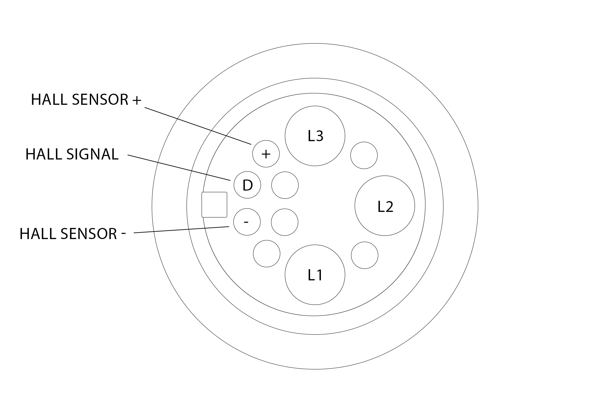

# Motor Connector

The motor is connected to the smart-cartridge with an 11-pin Higo connector, model Z1115A.([https://www.higoconnector.com/products/z1115ag-p-00-du-1000/LZ99K](https://www.higoconnector.com/products/z1115ag-p-00-du-1000/LZ99K))

However, not all pins of the connector are used, actually only 6 pins are in use.

<figure><figcaption></figcaption></figure>
